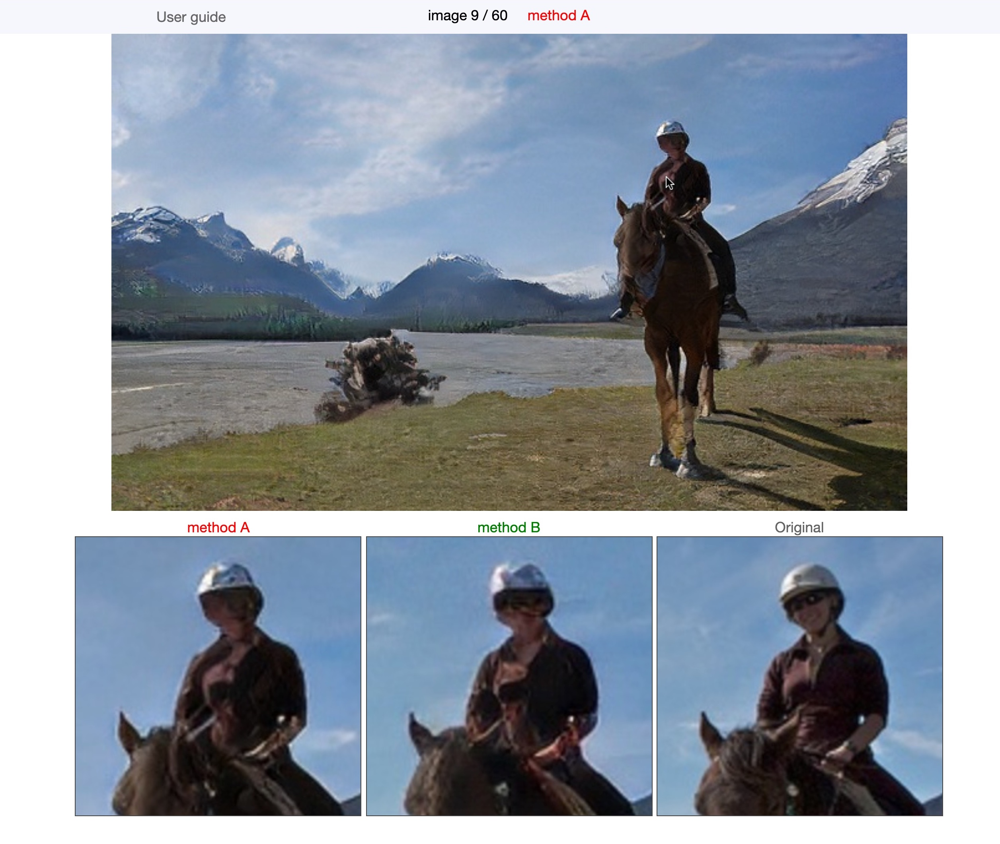

# Image Comparison Tool

主観評価実験等で使用するための画像比較ツールです．[デモページ](https://iiclab.github.io/img_comparison_tool/example.html)



## Usage

#### 1. このリポジトリをFork＆clone
このリポジトリをforkし，iiclabのアカウントではなく個人のアカウントにリポジトリをコピーします．githubのページの右上にあるボタンです．
次にforkしたリポジトリをローカルにcloneします．

#### 2. 画像を用意する
比較に使いたい画像を`./images`以下に配置します．具体的には`./images/example`を参考にしてください

まず，比較したい2枚の画像とオリジナル画像を用意し，以下のようなディレクトリ構成で配置してください
```
./images/{user_study_name}/img{img_num}/{1~3}.jpg
```
- `{user_study_name}`：任意のディレクトリ名を設定して良いです．
- `img{img_num}`：`img1`, `img2`, ... `img10`のようにインデックスを設定します．
- `1.jpg`，`2.jpg`，`3.jpg`：実際の画面ではそれぞれ methodA, methodB，Originalとして表示されます．アンケートの公平性のため，比較したい2種類の手法のどちらを`1.jpg`，`2.jpg`にするのか画像ごとにランダムに設定することが望ましいです．

それらを縦横2倍に拡大した画像を以下のディレクトリ構成で用意してください．
```
./images/{user_study_name}/img{img_num}_large/{1~3}.jpg
```
(画像を小窓に表示するためにDriftというライブラリを使っています．Driftでは動的に画像を拡大しているのではなく，予め拡大された画像を表示しているので，拡大した画像を用意する必要があります．)

以上で画像の用意は終了です．

#### 3. htmlファイルを書き換える
`./index.html`を開き，後半のscript要素を書き換えます．
```
<script type="module">
    import { ImageViewer } from "./js/img_view.js"

    // 以下を変える
    document.title = ""; //ブラウザに表示されるタイトル
    const img_dir = ""; //画像を格納したディレクトリ
    const num_img = 0; //画像の枚数

    let viewer = new ImageViewer(num_img, 3, img_dir, 2, 'jpg');
    viewer.show_image();
</script>
```
書き換えるのは`///以下を変える`以下の3行で，書き方は`./example.html`を参考にして下さい．  

動作確認にはVSCodeの拡張機能「Live Server」が便利です．[参考記事](https://www.mitsue.co.jp/knowledge/blog/frontend/201810/02_1329.html)  
拡張機能をインストールした後にVSCodeでこのリポジトリを開き，画面右下の"Go Live"をクリックするとブラウザに画面が表示されます．画像が表示されていて，キーボードで画面操作ができていれば成功です．

画像の用意とhtmlファイルの書き換えが完了したら，リポジトリに変更をコミット，プッシュしておきます．

#### 4. GitHub pagesで公開
github pagesの使い方は[この記事](https://prog-8.com/docs/github-pages)などが参考になります．  

また，GitHub PROに登録することをおすすめします．学生は無料で，申請も簡単です．[参考記事](https://qiita.com/Kobayashi2019/items/5adb9bde57691a770419)  
通常のプランではパブリックリポジトリに設定しないとGitHub pagesが使えませんが，PROに登録するとプライベートリポジトリでも使えるようになります．このリポジトリには研究成果が含まれると思うので，パブリックにするのはおすすめしません．どうせ無料なのでPROにしておきましょう．

github pagesで画像が表示されることが確認できたら準備完了です．

## TODO
- 画像の準備(シャッフル，拡大等)を行うスクリプトの作成
- 3枚だけでなく2枚の画像の比較